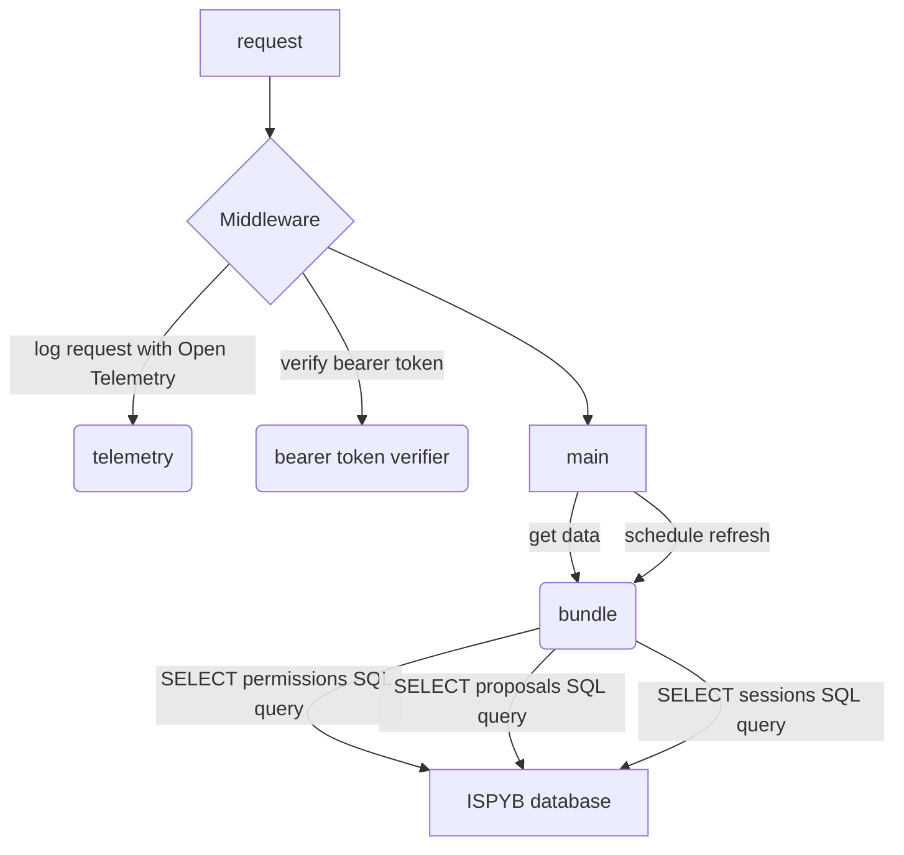

# Bundler

An Open Policy Agent (OPA) Bundle Server, supplying permissionalble data from the Diamond Light Source ISPyB database

# Rust code explanation

## Information flow and division of responsibility between files.

The *main* responsibilities are handled in `main.rs`, that is:
- serving the application through an endpoint 
- adding the *middleware* to received requests
- calling the *bundle* to get the *data* from ispyb to cache.
- periodically telling the *bundle* to get new *data* to refresh the cache.

The *middleware* comprises:
- open telemetry setup - inside `main.rs`
- bearer token verification - inside `require_bearer.rs`

`main.rs` is agnostic regarding the contents of the *bundle*. That is abstracted away inside the `bundle.rs`.
There is the key *data* structure, `pub struct Bundle<Metadata>`.
It contains references to all the necessary *permissionables*.
The are made up of query results from *ISPYB*:
- permissions
- proposals
- sessions
The queries are done with [sqlx](https://github.com/launchbadge/sqlx), Rust async library for interactions with SQL databases.

## Flowchart

## Roadmap
?
