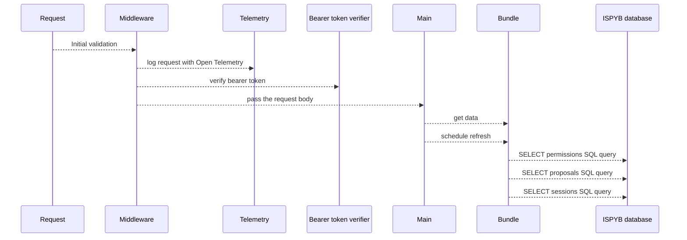

# Bundler

An Open Policy Agent (OPA) Bundle Server, supplying permissionalble data from the Diamond Light Source ISPyB database

## Rust code explanation

### Information flow and division of responsibility between files

The _main_ responsibilities are handled in `main.rs`, that is:

- serving the application through an endpoint
- adding the _middleware_ to received requests
- calling the _bundle_ to get the _data_ from ispyb to cache.
- periodically telling the _bundle_ to get new _data_ to refresh the cache.

The _middleware_ comprises:

- open telemetry setup - inside `main.rs`
- bearer token verification - inside `require_bearer.rs`

`main.rs` is agnostic regarding the contents of the _bundle_. That is abstracted away inside the `bundle.rs`.
There is the key _data_ structure, `pub struct Bundle<Metadata>`.
It contains references to all the necessary _permissionables_.
The are made up of query results from _ISPYB_:

- permissions
- proposals
- sessions
  The queries are done with [sqlx](https://github.com/launchbadge/sqlx), Rust async library for interactions with SQL databases.

### Flowchart

