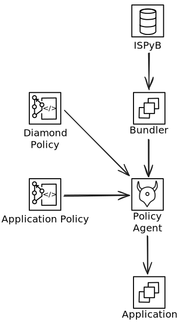

# Data Flow

In order to make authorization decisions policy agents must hold both policy and data about the entities they are permitting. These are loaded into [Open Policy Agent (OPA)](https://www.openpolicyagent.org/) via [bundles](https://www.openpolicyagent.org/docs/latest/management-bundles/). Typically three bundles are loaded; [Diamond Data](../references/diamond-data-bundle.md), Diamond Policy, and Application Policy. Policy bundles are loaded from OCI registries and are typically updated infrequently whilst Permissionable Data must be kept in sync with the information in ISPyB and is therefore exposed by the Bundler - an HTTP server which supplies OPA compliant data bundles.

