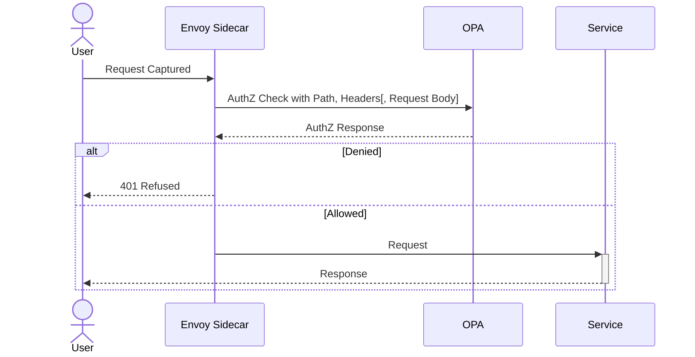
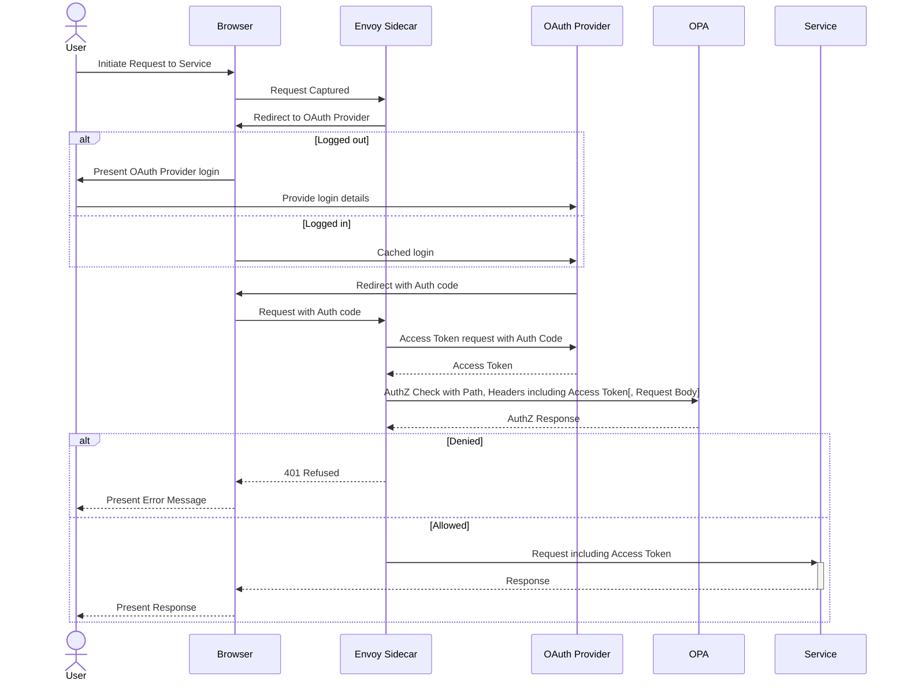

# Deploy with Istio

## Preface

This guide will explain how to integrate an OPA instance as part of a Kubernetes deployment making use of the [Istio Service Mesh](https://istio.io/latest/about/service-mesh/) and [Envoy external authorization filter](https://www.envoyproxy.io/docs/envoy/latest/api-v3/extensions/filters/http/ext_authz/v3/ext_authz.proto) to authorize all incoming traffic to a pod against OPA policy.

It is intended to follow on from [deploying OPA with Helm](./deploy-with-helm.md), and implements the following flow for Authorization.



However, as Authorization without trusted Authentication information is effectively useless, it is highly recommended to implement Authentication also within the Service Mesh, giving the full sequence diagram below. While the complete diagram is slightly involved, note that the total activation of the service that is being deployed is minimal, and all prior steps are entirely agnostic to the form of the service.



## Adjust the OPA deployment

To allow the Envoy sidecar to communicate with the OPA instance, it must use and configure the OPA-Envoy plugin, which requires the following changes to the `values.yaml` of the Helm chart that has opa as a dependency:

```yaml
opa:
  image:
    envoy: true
  opa:
    config:
      plugins:
        envoy_ext_authz_grpc:
          path: path/to/your/policy/root
```

## Enable Envoy Sidecar injection

The Istio ServiceMesh operates by injecting a sidecar container alongside your service which intercepts all incoming traffic. To enable the injection of this sidecar, the following label must be added to your service's deployment.

```yaml
spec:
  template:
    metadata:
      labels:
        sidecar.istio.io/inject: 'true'
```

## Installing the External Authorization EnvoyFilter into the Envoy instance

An Envoy sidecar checks all incoming traffic against a series of filters, adjusting, allowing or rejecting traffic accordingly. The following configures an external authorization filter that will check all incoming traffic, passing the headers and path (and optionally the body of the request) to your OPA instance configured above.

```yaml
apiVersion: networking.istio.io/v1alpha3
kind: EnvoyFilter
metadata:
  name: authz-envoyfilter
spec:
#   workloadSelector:  # Apply to a subset of Pods
#     labels:
#       app: reviews
  configPatches:
    - applyTo: HTTP_FILTER
      match:
        context: SIDECAR_INBOUND
        listener:
          filterChain:
            filter:
              name: "envoy.filters.network.http_connection_manager"
              subFilter:
                name: "envoy.filters.http.router"
      patch:
        operation: INSERT_BEFORE
        filterClass: AUTHZ
        value:
          name: envoy.ext_authz
          typed_config:
            "@type": type.googleapis.com/envoy.extensions.filters.http.ext_authz.v3.ExtAuthz
            transport_api_version: V3
            status_on_error:
              code: ServiceUnavailable
            # with_request_body: # Optionally pass body of request as part of AuthZ query
            #   max_request_bytes: 8192
            #   allow_partial_message: true
            grpc_service:
              # EnvoyGrpc has issue with requiring http2, use of GoogleGrpc seems to be standard
              google_grpc:
                target_uri: {{ include "opa.fullname" . }}:9191  # N.B. Must be the name of your OPA service in the namespace
                stat_prefix: "ext_authz"
```
