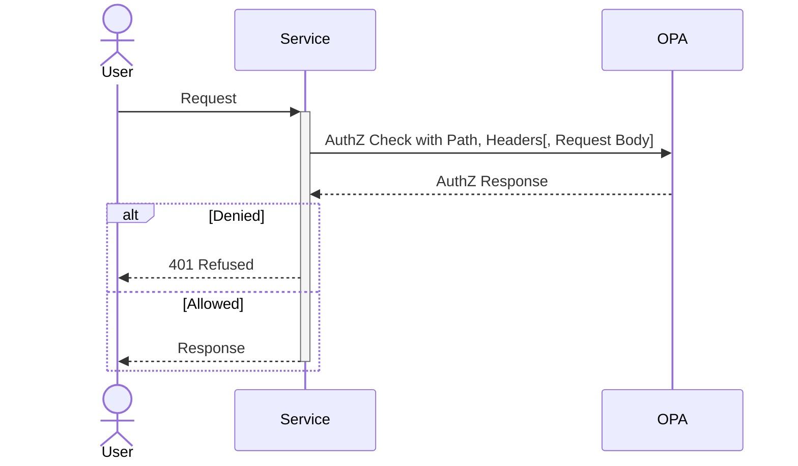
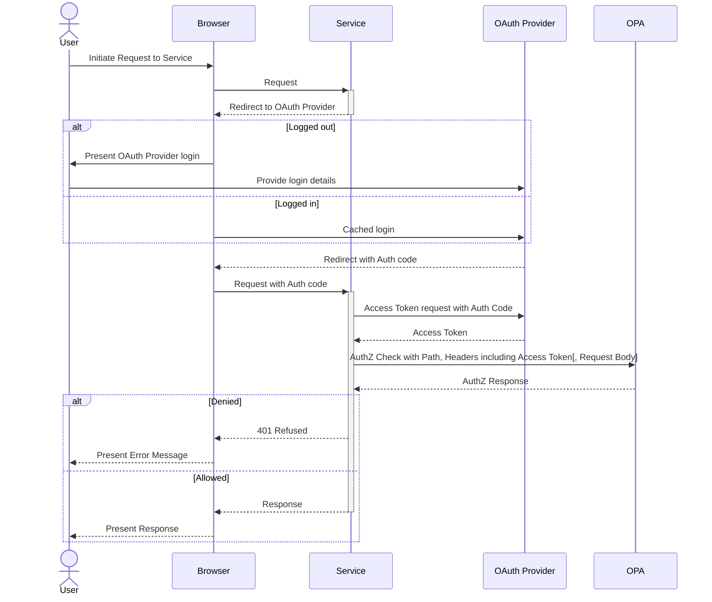

# Python Example

## Preface

This guide will explain how to integrate an OPA instance as a FastAPI middleware to authorize all incoming traffic against OPA policy using the [fastapi-opa](https://github.com/busykoala/fastapi-opa) package.

It is intended to follow on from [deploying OPA with Helm](deploy-with-helm.md), and implements the following flow for Authorization.



However, as Authorization without trusted Authentication information is effectively useless, the `fasapi-opa` middleware moves this Authentication layer into the service application, giving the full sequence diagram below. While less involved than the full sequence diagram using [the Istio Service Mesh](deploy-with-istio.md), note that the total activation of the service that is to be deployed is larger, more involved and requires handling of the OAuth client-secret for Authentication.



## Add the fastapi-opa middleware to your FastAPI app

```python
from fastapi import FastAPI

from fastapi_opa import OPAConfig
from fastapi_opa import OPAMiddleware
from fastapi_opa.auth import OIDCAuthentication
from fastapi_opa.auth import OIDCConfig

oidc_config = OIDCConfig(
    app_uri=os.getenv("APP_URI"),
    client_id=os.getenv("OIDC_CLIENT_ID"),
    client_secret=os.getenv("OIDC_CLIENT_SECRET"),
    well_known_endpoint=os.getenv("OIDC_WELL_KNOWN"),
)
oidc_auth = OIDCAuthentication(oidc_config)
opa_config = OPAConfig(authentication=oidc_auth, opa_host=os.getenv("OPA_HOST"))

app = FastAPI()
app.add_middleware(OPAMiddleware, config=opa_config)

@app.get("/my/endpoint")
async def foo() -> str:
    return "bar"
```

Assuming that the OIDC `client-id`, `client-secret` have been mounted to your service's container as environment variables from a secret named `oidc-secret`, e.g. as below, appended to the spec of its Deployment. The `APP_URI`, `OIDC_WELL_KNOWN` are also assumed to be mounted from configuration, as the former will require knowledge of your Ingress set up, and the latter of your OAuth provider.

```yaml
env:
- name: OIDC_CLIENT_ID
  valueFrom:
    secretKeyRef:
      name: oidc-secret
      key: oidc-client
[...]
```

## Using the fastapi-opa middleware with an alternative Authentication method

While it is highly recommended to implement Authentication and Authorization together, in the case that you are already authenticating your requests, e.g. with `OAuth2-Proxy`, or through the ServiceMesh, the following configuration allows for a `fastapi-opa` configuration without embedded authentication. This is NOT RECOMMENDED.

```python
opa_config = OPAConfig(authentication=[], opa_host=os.getenv("OPA_HOST"))
```
